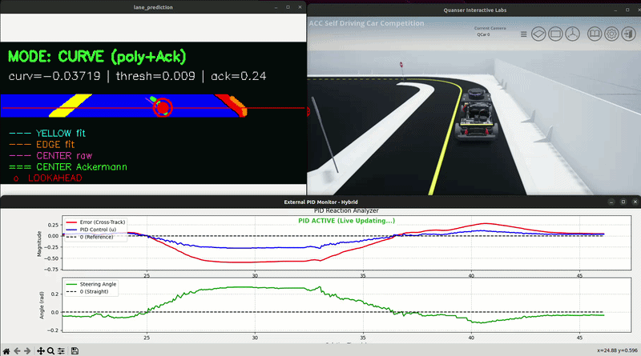

<div align="center">

# :racing_car: Team Seeker — QCar2 Autonomous Driving System

### ACC Self-Driving Competition 2026 — Virtual Phase

[](https://docs.ros.org/en/humble/)
[](https://developer.nvidia.com/isaac-ros)
[](https://developer.nvidia.com/tensorrt)
[](https://www.python.org/)
[](https://isocpp.org/)
[](LICENSE)

---

<table>
<tr>
<td align="center" width="33%">

**:joystick: Hybrid Controller Tracking**



</td>
<td align="center" width="33%">

**:racing_car: Full Autonomous System**


</td>
<td align="center" width="33%">

**:world_map: Real-Time Auto-Mapping**


</td>
</tr>
</table>

---

**Team Seeker** — Universidad Católica Boliviana "San Pablo" (UCB)

| Member | Role | GitHub |
|---|---|---|
| **Eduardo Vargas** | Perception & Navigation | [](https://github.com/HBKEduardex) |
| **Brayan Duran** | Systems & Integration | [](https://github.com/97hackbrian) |
| **Leyla Lipa** | Planning & Control | |
| **Mariel Valeriano** | Detection & Safety | |

</div>

---

## :page_facing_up: Abstract

This repository contains the complete software stack developed by **Team Seeker** for the [Autonomous Coding Challenge (ACC) Self-Driving Competition 2026](https://www.quanser.com/). The objective is to implement a fully autonomous driving system on the **Quanser QCar2** 1:10-scale vehicle platform.

<div align="center">

> **:movie_camera: Watch our demos!**
>
> [](https://youtu.be/N5glQULDirw?si=uXXSr9TTscwp94xa)
> [](https://youtu.be/a0JIzkAq0CM)

</div>

The current codebase corresponds to the **virtual phase**, where the entire pipeline is validated inside the **Quanser QLabs** simulator. The system is built on **ROS 2 Humble Hawksbill** running within a custom **NVIDIA Isaac ROS 2.1** Docker environment (Ubuntu 20.04), leveraging GPU-accelerated perception through NVIDIA NITROS and TensorRT.

> **Physical phase:** Implementation on the real QCar2 hardware is planned contingent upon qualification. *(Coming soon)*

### :dart: Key capabilities

- :camera: **Semantic lane segmentation** via a multi-stage image processing pipeline: ROI cropping, Gaussian pre-blur, HSV + CLAHE illumination normalization, GPU-accelerated LUT color classification (CuPy), morphological cleanup, and edge detection. A U-Net model deployed via Isaac ROS NITROS/TensorRT was also developed and trained, but was ultimately replaced by the classical pipeline due to high inference latency in real-time operation.
- :eyes: **Object detection** (persons, stop signs, traffic lights, zebra crossings) using YOLOv8s with Isaac ROS TensorRT inference.
- :world_map: **3D road surface reconstruction** via depth-masked TSDF integration with Isaac ROS Nvblox.
- :twisted_rightwards_arrows: **Hybrid navigation** combining lane-following PID control with Nav2 global path planning through a pixel-gated finite state machine.
- :deciduous_tree: **Behavior tree mission orchestration** for autonomous goal dispatch, mode switching, LED control, and detection-reactive behaviors.
- :compass: **Directional path planning** with right-hand-traffic-aware oriented A\* search on Cartographer-generated maps.

---

## :gear: System Architecture — Operating Modes

The system operates in **two distinct modes**, each launched independently depending on the mission phase.

### :green_circle: Mode A — Autonomous Mission (`qcar2_behavior_tree_mother.launch.py`)

This is the **primary operating mode** for competition runs. A behavior tree orchestrates the full mission while a pixel-gated hybrid switch controller decides between lane-following PID and Nav2 navigation in real time.

```
qcar2_behavior_tree_mother.launch.py
│
├─► qcar2_hybrid_planner.launch.py (qcar2_mixer)
│   │
│   ├─► mamalaunch.py (qcar2_tracking / qcar2_teleop)
│   │   ├── fixed_lidar_frame_virtual          TF: base_link → lidar
│   │   ├── Cartographer SLAM                  2D map building (cartographer_node + occupancy_grid)
│   │   ├── Nav2 stack                         Planner + Controller + BT Navigator (planning only, no motor output)
│   │   ├── AMCL                               Localization on the live map
│   │   ├── color_segmentation_node            HSV + CuPy GPU lane segmentation
│   │   └── yellow_line_position_node          Lane center offset computation
│   │
│   ├─► hybrid_switch_launch.py (qcar2_tracking / qcar2_teleop)
│   │   ├── yellow_line_follower_controller    PID lane-following (publish_motor_cmd=False)
│   │   ├── hybrid_switch_controller           Pixel-gated FSM — ONLY node that publishes /hybrid/motor
│   │   └── bridge_monitor                     Terminal status display
│   │
│   ├─► qcar2_planner_server.launch.py (qcar2_planner)
│   │   ├── map_loader_node                    Loads pre-saved occupancy map (auto_enable=false)
│   │   └── directional_planner_server         Oriented A* planner → /mission_goals
│   │
│   ├─► qcar2_detections.launch.py (qcar2_object_detections)
│   │   ├── image_preprocessor_node            Letterbox resize (480×640 → 640×640)
│   │   ├── YOLOv8s (Isaac ROS TensorRT)       GPU-accelerated object detection
│   │   ├── detection_filter_node              Per-class filtering + traffic light HSV analysis
│   │   └── detection_visualizer_node          Annotated debug image output
│   │
│   ├── qcar2_mixer_node                       Safety-aware command mixer (LIDAR, detections, LED)
│   └── led_sequence_node                      LED pattern sequencer for mission state indication
│
└── qcar2_behavior_tree_manager                BT orchestrator: goals, modes, LEDs, detection reactions
```

**Data flow (Mode A):**

```
 Camera ──► color_segmentation ──► yellow_line_position ──► PID Controller ─┐
                                                                             │  /lane/motor_cmd
                                                                             ▼
 Nav2 Planner ──► /cmd_vel_nav ──► hybrid_switch_controller ──► /hybrid/motor
                                    (pixel-gated FSM)              │
                                                                   ▼
 LIDAR ──────────────────────────────────────────────────► qcar2_mixer_node
 YOLOv8s Detections ──► /detections/* ──────────────────►  (safety layer)
                                                                   │
                                                                   ▼
                                                        /qcar2_motor_speed_cmd
                                                          (to QCar2 hardware)
```

The **hybrid_switch_controller** is a pixel-gated finite state machine that examines the segmentation mask to decide which control source to use:
- When yellow lane pixels are detected → **lane-following PID** controls steering
- When in blue/intersection zones or no lane detected → **Nav2** controls the vehicle
- The BT manager dispatches goals to `/bt/goal`, which the planner decomposes into `/mission_goals` waypoints for the hybrid switch

### :blue_circle: Mode B — Mapping Mode (`qcar2_mixer.launch.py`)

This mode is used for **building 3D road maps** with Nvblox before the autonomous mission. It creates both a 2D occupancy grid (Cartographer) and a 3D TSDF road surface (Nvblox) that are later used by Mode A.

```
qcar2_mixer.launch.py
│
├─► nvblox_road_mapping.launch.py (qcar2_LaneMapping-ACC / lane_mapping_acc)
│   ├── static_transform_publisher             TF: base_link → camera_depth_optical_frame
│   ├── color_segmentation_node                HSV lane segmentation (roi_height_ratio=0.2)
│   ├── road_segmentation.launch.py            road_mask_extractor + depth_masker + camera_info_publisher
│   ├── cartographer_mapping.launch.py         Cartographer SLAM (2D occupancy grid generation)
│   └── nvblox_node                            3D TSDF road surface reconstruction
│
├─► qcar2_mapping_planner.launch.py (qcar2_planner)
│   ├── map_processor_node                     Mesh → GridMap conversion (perception engine)
│   ├── exploration_manager_node               State monitor: MAPPING / READY
│   └── directional_planner_server             Oriented A* planner
│
├─► qcar2_detections.launch.py (qcar2_object_detections)
│   ├── image_preprocessor_node                Letterbox resize
│   ├── YOLOv8s (Isaac ROS TensorRT)           GPU-accelerated object detection
│   ├── detection_filter_node                  Per-class detection filtering
│   └── detection_visualizer_node              Annotated debug image
│
├─► qcar2_hybrid_nav_launch.py (qcar2_tracking / qcar2_teleop)
│   ├── Nav2 stack                             Planner + Controller + BT Navigator
│   ├── AMCL                                   Localization (Cartographer SLAM runs in nvblox_road_mapping)
│   ├── color_segmentation_node                HSV + CuPy lane segmentation
│   ├── yellow_line_position_node              Lane center offset
│   ├── yellow_line_follower_controller        PID lane-following → /lane/motor_cmd
│   └── (optional) hybrid_controller           Nav2 + lane fusion bridge
│
└── qcar2_mixer_node                           Safety-aware command mixer (no LED node in this mode)
```

**Key differences from Mode A:**

| Aspect | Mode A (Autonomous Mission) | Mode B (Mapping) |
|---|---|---|
| **SLAM** | Cartographer in mamalaunch | Cartographer in nvblox_road_mapping |
| **3D Mapping** | Not active | Nvblox TSDF road reconstruction |
| **Planner** | map_loader + planner_server (saved map) | map_processor + exploration_manager + planner (live) |
| **Motor control** | hybrid_switch_controller (pixel-gated FSM) | yellow_line_follower_controller (PID) + optional hybrid_controller |
| **LED sequence** | Active (led_sequence_node) | Not active |
| **BT Manager** | Active (mission orchestration) | Not active |

---

## :package: Package Overview

### Custom packages (developed by Team Seeker)

| Package | ROS Name | Type | Description |
|---|---|---|---|
| [`qcar2_behavior_tree`](https://github.com/97hackbrian/qcar2_behavior_tree) | `qcar2_behavior_tree` | Python | **Mission orchestrator.** Behavior tree manager that dispatches navigation goals, switches driving modes (HYBRID / LANE_PID / STOPPED), controls LEDs, and reacts to object detections. Configurable via YAML. Used in Mode A only. |
| [`qcar2_mixer`](https://github.com/97hackbrian/qcar2_mixer) | `qcar2_mixer` | Python | **Safety-aware motor command mixer + launch orchestration.** Contains `qcar2_mixer_node` (LIDAR obstacle safety, traffic light / stop sign / pedestrian reactive stops, LED state), `led_sequence_node`, and the two top-level launch files: `qcar2_hybrid_planner.launch.py` (Mode A) and `qcar2_mixer.launch.py` (Mode B). |
| [`qcar2_nodex`](https://github.com/97hackbrian/qcar2_nodex) | `qcar2_nodex` | C++ | **Extended QCar2 hardware driver.** Fork of the Quanser `qcar2_nodes` driver with custom modifications. Provides `command`, `rgbd`, `lidar`, `csi`, and `qcar2_hardware` nodes. |
| [`qcar2_object_detections`](https://github.com/97hackbrian/Yolo_v8) | `qcar2_object_detections` | C++/Python | **Object detection pipeline.** Image preprocessing (letterbox resize), YOLOv8s inference via Isaac ROS TensorRT, ROI-based detection filtering, traffic light HSV color analysis. Publishes per-class detection topics: person, stop sign, traffic light, zebra crossing. |
| [`qcar2_LaneSeg-ACC`](https://github.com/97hackbrian/LaneSeg-ACC) | `qcar2_laneseg_acc` | C++/Python | **Semantic lane segmentation.** Active pipeline uses `color_segmentation_node`: HSV + CLAHE + CuPy GPU-accelerated LUT color classification + morphological cleanup + edge detection. A U-Net model was also developed and trained but replaced due to high inference latency. Includes camera buffering and image capture utilities. |
| [`qcar2_LaneMapping-ACC`](https://github.com/97hackbrian/LaneMapping-ACC) | `lane_mapping_acc` | C++/Python | **Road surface 3D mapping.** Extracts road regions from segmentation masks, masks depth images for road-only surfaces, and feeds them into Nvblox for TSDF reconstruction. Includes Cartographer mapping launch and synthetic CameraInfo generation. Used in Mode B. |
| [`qcar2_planner`](https://github.com/97hackbrian/qcar2_planner) | `qcar2_planner` | C++/Python | **Directional path planner.** Oriented A\* algorithm that generates `nav_msgs/Path` respecting right-hand traffic conventions. Operates in two modes: live mapping exploration (`qcar2_mapping_planner.launch.py`) or saved-map navigation (`qcar2_planner_server.launch.py`). |
| [`qcar2_tracking`](https://github.com/HBKEduardex/Qcar_tracking) | `qcar2_teleop` | Python | **Hybrid navigation and lane-following controllers.** Provides `yellow_line_position_node`, `yellow_line_follower_controller` (PID), `hybrid_switch_controller` (pixel-gated FSM for Mode A), `hybrid_controller` (Nav2+lane bridge for Mode B), `bridge_monitor`, PID tuner, and `mamalaunch.py` + `qcar2_hybrid_nav_launch.py`. |
| [`qcar2_lane_following`](https://github.com/97hackbrian/LaneFollow-ACC) | `qcar2_lane_following` | Python | **Lane following controller.** ¡Experimental! OpenCV-based lane detection coupled with a Stanley controller and Ackermann kinematics model. Provides detector and follower nodes. |

### Quanser-provided packages (included locally)

| Package | Description |
|---|---|
| `qcar2_interfaces` | Custom ROS 2 message definitions for QCar2 hardware (`MotorCommands`, `BooleanLeds`). |
| `qcar2_nodes` | Original Quanser hardware driver nodes. Links against Quanser SDK (`libhil`, `libquanser_*`). |
| `qcar2_autonomy` | High-level autonomy stack bundling Nav2 navigation, traffic detection, lane detection, and trip planning. |

### Third-party submodules

| Submodule | Source | Purpose |
|---|---|---|
| `isaac_ros_common` | [NVIDIA-ISAAC-ROS](https://github.com/NVIDIA-ISAAC-ROS/isaac_ros_common) | Isaac ROS common utilities and Docker tooling |
| `isaac_ros_dnn_inference` | [NVIDIA-ISAAC-ROS](https://github.com/NVIDIA-ISAAC-ROS/isaac_ros_dnn_inference) | TensorRT and Triton inference nodes |
| `isaac_ros_image_pipeline` | [NVIDIA-ISAAC-ROS](https://github.com/NVIDIA-ISAAC-ROS/isaac_ros_image_pipeline) | GPU-accelerated image processing |
| `isaac_ros_image_segmentation` | [NVIDIA-ISAAC-ROS](https://github.com/NVIDIA-ISAAC-ROS/isaac_ros_image_segmentation) | U-Net semantic segmentation node |
| `isaac_ros_nitros` | [NVIDIA-ISAAC-ROS](https://github.com/NVIDIA-ISAAC-ROS/isaac_ros_nitros) | NVIDIA NITROS zero-copy transport layer |
| `isaac_ros_nvblox` | [NVIDIA-ISAAC-ROS](https://github.com/NVIDIA-ISAAC-ROS/isaac_ros_nvblox) | GPU-accelerated 3D TSDF reconstruction |
| `isaac_ros_object_detection` | [NVIDIA-ISAAC-ROS](https://github.com/NVIDIA-ISAAC-ROS/isaac_ros_object_detection) | DetectNet and YOLOv8 wrappers |
| `filters` | [ros/filters](https://github.com/ros/filters) | ROS 2 signal filtering library |
| `grid_map` | [ANYbotics/grid_map](https://github.com/ANYbotics/grid_map) | 2.5D grid map framework |
| `rtabmap` | [introlab/rtabmap](https://github.com/introlab/rtabmap) | Real-Time Appearance-Based Mapping |
| `rtabmap_ros` | [97hackbrian/rtabmap_ros](https://github.com/97hackbrian/rtabmap_ros) | ROS 2 wrapper for RTAB-Map (fork) |
| `teleop_twist_keyboard` | [ros2/teleop_twist_keyboard](https://github.com/ros2/teleop_twist_keyboard) | Keyboard teleoperation |

### Standard ROS 2 dependencies

`nav2_bringup`, `nav2_amcl`, `nav2_common`, `cartographer_ros`, `tf2_ros`, `tf2_geometry_msgs`, `cv_bridge`, `image_transport`, `message_filters`, `grid_map_msgs`, among others.

---

## :wrench: Prerequisites

| Requirement | Details |
|---|---|
| **NVIDIA Isaac ROS 2.1 Docker** | Custom container based on Ubuntu 20.04 with ROS 2 Humble and CUDA/TensorRT support |
| **Quanser QLabs** | QCar2 virtual environment simulator (host machine) |
| **NVIDIA GPU** | Required for TensorRT inference and NITROS acceleration |
| **colcon** | `sudo apt install python3-colcon-common-extensions` |
| **rosdep** | `sudo apt install python3-rosdep && sudo rosdep init && rosdep update` |

### Directory conventions

| Context | Path |
|---|---|
| **Host (local)** | `~/Documents/ACC_Development/Development/` |
| **Inside Docker** | `/workspaces/isaac_ros-dev/` |
| **Workspace root** | `seeker_ws/` (contains `src/`, `build/`, `install/`, `log/`) |

---

## :rocket: Getting Started

### 1. Create the workspace (host machine)

```bash
mkdir -p ~/Documents/ACC_Development/Development/seeker_ws/src
cd ~/Documents/ACC_Development/Development/seeker_ws/src
```

### 2. Clone with submodules

```bash
cd ~/Documents/ACC_Development/Development/seeker_ws/src
git clone --recursive https://github.com/97hackbrian/qcar2_seeker_ACC2026.git .
```

If already cloned without `--recursive`:

```bash
git submodule update --init --recursive
```

### 3. Start the Isaac ROS Docker container

Launch the Isaac ROS 2.1 Docker environment. The local `~/Documents/ACC_Development/Development/` directory is mounted at `/workspaces/isaac_ros-dev/` inside the container.

### 4. Copy the YOLOv8s ONNX model

The object detection pipeline requires the YOLOv8s ONNX model at `/tmp/yolov8s.onnx` inside the container:

```bash
cp /workspaces/isaac_ros-dev/seeker_ws/src/utils/yolov8s.onnx /tmp/yolov8s.onnx
```

### 5. Build the workspace (inside Docker)

Navigate to the workspace root:

```bash
cd /workspaces/isaac_ros-dev/seeker_ws
```

Build only the required packages and their full dependency chains using `--packages-up-to`:

```bash
colcon build --packages-up-to qcar2_behavior_tree qcar2_teleop qcar2_planner lane_mapping_acc qcar2_mixer
```

On memory-constrained systems (e.g., NVIDIA Jetson), limit parallel workers:

```bash
colcon build --packages-up-to qcar2_behavior_tree qcar2_teleop qcar2_planner lane_mapping_acc qcar2_mixer --parallel-workers 2
```

This resolves and builds the complete dependency tree:

```
qcar2_interfaces ─► qcar2_nodes ─► qcar2_nodex ──────► qcar2_mixer ─┐
qcar2_object_detections ─► qcar2_laneseg_acc ─► lane_mapping_acc ────┤
qcar2_lane_following ─► qcar2_tracking (qcar2_teleop) ──────────────┤
qcar2_planner ──────────────────────────────────────────────────────┤
                                                                     ▼
                                                      qcar2_behavior_tree
```

> **Why `--packages-up-to`?**  This flag instructs `colcon` to build only the specified target packages and their transitive dependencies, skipping all unrelated packages in the workspace. This significantly reduces compilation time in large multi-package workspaces.

### 6. Source the workspace

Run this in **every terminal** before launching nodes:

```bash
source /workspaces/isaac_ros-dev/seeker_ws/install/setup.bash
```

> **Tip:** Append to `~/.bashrc` for automatic sourcing.

---

## :joystick: Running the System

All commands below are executed **inside the Docker container**.

### :green_circle: Mode A — Autonomous Mission (competition run)

This is the standard operating procedure for competition runs. Requires a pre-built map.

#### Terminal 1 — QCar2 virtual hardware drivers

```bash
source /workspaces/isaac_ros-dev/seeker_ws/install/setup.bash
ros2 launch qcar2_nodex qcar2_virtual_launch.py
```

Launches the simulated QCar2 hardware nodes (motors, RGBD camera, LIDAR, CSI cameras) connected to QLabs.

#### Terminal 2 — Behavior tree autonomous mission

```bash
source /workspaces/isaac_ros-dev/seeker_ws/install/setup.bash
ros2 launch qcar2_behavior_tree qcar2_behavior_tree_mother.launch.py
```

This single launch file brings up the **entire autonomous stack**:

| Component | Launch file | What it starts |
|---|---|---|
| **SLAM + Nav2 + Lane** | `mamalaunch.py` | Cartographer SLAM, Nav2 (planning only), AMCL, color segmentation, yellow line position |
| **Hybrid Switch** | `hybrid_switch_launch.py` | PID controller, pixel-gated FSM (motor output), bridge monitor |
| **Path Planner** | `qcar2_planner_server.launch.py` | Map loader + directional planner server (loads saved map) |
| **Object Detection** | `qcar2_detections.launch.py` | Image preprocessor, YOLOv8s (TensorRT), detection filter, visualizer |
| **Mixer + LEDs** | (inline nodes) | `qcar2_mixer_node` (safety layer) + `led_sequence_node` |
| **Mission Control** | (inline node) | `qcar2_behavior_tree_manager` (BT orchestrator) |

#### Optional: custom mission configuration

```bash
ros2 launch qcar2_behavior_tree qcar2_behavior_tree_mother.launch.py \
  bt_config:=/absolute/path/to/your/behavior_tree.yaml
```

---

### :blue_circle: Mode B — Mapping Mode (map building)

Use this mode **before** the autonomous mission to build the 3D road map and occupancy grid.

#### Terminal 1 — QCar2 virtual hardware drivers

```bash
source /workspaces/isaac_ros-dev/seeker_ws/install/setup.bash
ros2 launch qcar2_nodex qcar2_virtual_launch.py
```

#### Terminal 2 — Mapping pipeline

```bash
source /workspaces/isaac_ros-dev/seeker_ws/install/setup.bash
ros2 launch qcar2_mixer qcar2_mixer.launch.py
```

This brings up:

| Component | Launch file | What it starts |
|---|---|---|
| **Nvblox + Cartographer** | `nvblox_road_mapping.launch.py` | Static TF, color segmentation (road), road mask extraction, depth masking, Cartographer SLAM, Nvblox 3D TSDF |
| **Live Planner** | `qcar2_mapping_planner.launch.py` | Map processor, exploration manager, directional planner (live exploration) |
| **Object Detection** | `qcar2_detections.launch.py` | Image preprocessor, YOLOv8s (TensorRT), detection filter, visualizer |
| **Nav2 + Lane** | `qcar2_hybrid_nav_launch.py` | Nav2 stack, AMCL, color segmentation, yellow line position, PID controller, optional hybrid bridge |
| **Mixer** | (inline node) | `qcar2_mixer_node` (safety layer, no LEDs) |

**Workflow:** Drive the vehicle (manually or via Nav2 goals) to explore the environment. Cartographer builds the 2D map while Nvblox reconstructs the 3D road surface. Once the map is complete, save it and switch to Mode A for the autonomous mission.

---

## :clapper: Demonstration

<div align="center">
<table>
<tr>
<td align="center">

**:joystick: Hybrid Controller Tracking**


*Pixel-gated hybrid switch: PID lane-following + Nav2 navigation fusion test*

</td>
</tr>
<tr>
<td align="center">

**:racing_car: Full Autonomous System**


*Complete pipeline: BT mission orchestration, hybrid navigation, YOLOv8s detections, safety mixer*

</td>
</tr>
<tr>
<td align="center">

**:world_map: Real-Time Auto-Mapping**


*Autonomous exploration: Cartographer SLAM + Nvblox TSDF 3D road surface reconstruction*

</td>
</tr>
</table>
</div>

---

## :gear: Configuration Reference

### Mission configuration (`behavior_tree.yaml`)

Located at `qcar2_behavior_tree/config/behavior_tree.yaml`:

```yaml
qcar2_behavior_tree_manager:
  ros__parameters:
    tick_hz: 5.0                    # BT tick frequency (Hz)
    require_tf: true                # Wait for TF chain map→odom→base_link
    goal_reached_distance: 0.35     # Goal proximity threshold (meters)
    goal_timeout_sec: 900.0         # Per-goal timeout (seconds)
    goal_frame_id: map

    # Navigation goals [x, y, yaw]
    goal_1: [-1.75, 5.16, 0.0]
    goal_2: [-0.75, 1.64, 0.0]
    goal_3: [1.155, 4.433, 0.0]
    goal_4: [0.0, 0.0, 0.0]
    additional_goals: []

    default_mode_hybrid: HYBRID
    mode_code_stop: 0.0
    mode_code_hybrid: 1.0
    mode_code_pid: 2.0

    # Mission sequence — executed top-to-bottom, then loops
    mission_loop:
      - set_mode:HYBRID
      - set_led:init
      - wait:3.0
      - set_led:to_pickup
      - dispatch_next_goal
      - wait_goal_reached_or_timeout
      - wait:5.0
      - set_led:pickup_done
      - dispatch_next_goal
      - wait_goal_reached_or_timeout
      - set_led:dropoff_done
      - wait:5.0
      - set_mode:STOPPED
```

### Available `mission_loop` commands

| Command | Description |
|---|---|
| `set_mode:<MODE>` | Switch driving mode: `HYBRID`, `LANE_PID`, `LANE_ONLY`, `NAV2_TURN`, `NAV2_FORCED`, `STOPPED` |
| `set_led:<command>` | Publish LED command string to `/btled` |
| `wait:<seconds>` | Pause mission execution for N seconds |
| `dispatch_next_goal` | Publish the next goal as `PoseStamped` to `/bt/goal` |
| `wait_goal_reached_or_timeout` | Block until the robot reaches the goal or the timeout expires |

### Driving modes

| Mode | Numeric code | Behavior |
|---|---|---|
| `HYBRID` | 1.0 | Pixel-gated FSM: lane-following PID when yellow lane detected, Nav2 at intersections/blue zones |
| `LANE_PID` | 2.0 | Lane-following PID controller only |
| `LANE_ONLY` | 2.0 | Lane-following only (alias) |
| `NAV2_TURN` | 1.0 | Nav2-driven turning maneuver |
| `NAV2_FORCED` | 1.0 | Forced Nav2 path following |
| `STOPPED` | 0.0 | All motors stopped |

### Mixer safety logic (`qcar2_mixer_node`)

The mixer implements the following safety behaviors applied to the final motor command:

| Detection | Behavior |
|---|---|
| **LIDAR obstacle** (within configurable distance at ±30°) | Immediate stop |
| **Person detected** | Stop while visible + configurable timeout after disappearing |
| **Stop sign** | Stop for `stop_sign_stop_time` seconds, then advance straight for `stop_sign_forward_time` |
| **Traffic light (red) + zebra crossing** | Stop until green |
| **Traffic light (any) without zebra** | Bypass (ignore) |
| **Zebra crossing only** | Reduce speed by configurable factor |

---

## :electric_plug: ROS 2 Interface

### Behavior Tree Manager topics

#### Published

| Topic | Type | Description |
|---|---|---|
| `/bt/goal` | `geometry_msgs/PoseStamped` | Current navigation goal |
| `/bt/state` | `std_msgs/String` | Runtime state (`GOAL_DISPATCHED`, `GOAL_REACHED`, `WAITING_TF_CHAIN`, etc.) |
| `/bt/mode_hybrid` | `std_msgs/String` | Current driving mode (text) |
| `/bt/mode_hybrid_numeric` | `std_msgs/Float32` | Current driving mode (numeric code) |
| `/btled` | `std_msgs/String` | LED command for `led_sequence_node` |

#### Subscribed

| Topic | Type | Description |
|---|---|---|
| `/detections/person` | `PersonDetection` | Person detection state |
| `/detections/stop_sign` | `StopSignDetection` | Stop sign detection state |
| `/detections/traffic_light` | `TrafficLightDetection` | Traffic light state (color) |
| `/detections/zebra_crossing` | `ZebraCrossingDetection` | Zebra crossing detection state |
| `/mixer/state` | `std_msgs/String` | Mixer state feedback |
| `/tf`, `/tf_static` | `tf2_msgs/TFMessage` | TF transforms for localization |

### Mixer Node topics

#### Published

| Topic | Type | Description |
|---|---|---|
| `/qcar2_motor_speed_cmd` | `MotorCommands` | Final motor command to hardware |
| `/qcar2_led_cmd` | `BooleanLeds` | LED state indicators |
| `/mixer/state` | `std_msgs/String` | Current mixer state (debug) |

#### Subscribed

| Topic | Type | Description |
|---|---|---|
| `/hybrid/motor` | `MotorCommands` | Input motor commands from hybrid switch |
| `/scan` | `LaserScan` | LIDAR for obstacle detection |
| `/detections/*` | (various) | All four detection topics |

---

## :toolbox: Troubleshooting

| Symptom | Probable cause | Fix |
|---|---|---|
| `WAITING_TF_CHAIN` persists indefinitely | SLAM or localization not running | Launch Cartographer/AMCL first, or set `require_tf: false` |
| No goals dispatched | Malformed goal parameters | Verify `goal_1`–`goal_4` are valid `[x, y, yaw]` in YAML |
| `qcar2_object_detections msgs not available` | Package not built | Rebuild: `colcon build --packages-up-to qcar2_behavior_tree` |
| TensorRT engine build fails | ONNX model missing | Ensure `yolov8s.onnx` is copied to `/tmp/` in the container |
| QLabs not connecting | Simulator not started on host | Start Quanser QLabs before launching ROS nodes |
| Vehicle drives straight, ignores lanes | `color_segmentation_node` not publishing | Check camera topic, verify HSV params in `qcar2_tracking_params.yaml` |
| Vehicle stops without obstacle | Mixer safety layer triggered | Check `/mixer/state` for which detection fired |
| Nav2 goals unreachable | Map not loaded or stale | Re-run Mode B to rebuild maps, or check `map_yaml_path` argument |

---

## :file_folder: Repository Structure

```
seeker_ws/src/
├── qcar2_behavior_tree/        # BT mission orchestrator (Mode A entry point)
├── qcar2_mixer/                # Safety mixer + Mode A/B launch files
├── qcar2_nodex/                # Extended QCar2 hardware drivers (C++)
├── qcar2_object_detections/    # YOLOv8 detection pipeline + custom msgs
├── qcar2_LaneSeg-ACC/          # HSV + CuPy lane segmentation
├── qcar2_LaneMapping-ACC/      # Nvblox road mapping (Mode B)
├── qcar2_planner/              # Directional A* path planner
├── qcar2_tracking/             # Hybrid nav controllers + mamalaunch
├── qcar2_lane_following/       # Lane detection + Stanley controller
├── qcar2_interfaces/           # Custom ROS 2 msgs (Quanser)
├── qcar2_nodes/                # Original QCar2 drivers (Quanser)
├── qcar2_autonomy/             # High-level autonomy stack (Quanser)
├── isaac_ros_*/                # NVIDIA Isaac ROS packages (submodules)
├── filters/                    # ROS 2 filters library (submodule)
├── grid_map/                   # ANYbotics grid map (submodule)
├── rtabmap/                    # RTAB-Map SLAM (submodule)
├── rtabmap_ros/                # RTAB-Map ROS 2 wrapper (submodule)
├── teleop_twist_keyboard/      # Keyboard teleop (submodule)
└── utils/
    └── yolov8s.onnx            # Pre-trained YOLOv8s ONNX model
```

---

## :scroll: License

This project is licensed under the **MIT License** — see the [LICENSE](LICENSE) file for details.

---

<div align="center">

**:racing_car: Team Seeker** — Universidad Católica Boliviana "San Pablo" (UCB)

Eduardo Vargas · Brayan Duran · Leyla Lipa · Mariel Valeriano

*ACC Self-Driving Competition 2026*

[](https://github.com/97hackbrian/qcar2_seeker_ACC2026)

</div>
